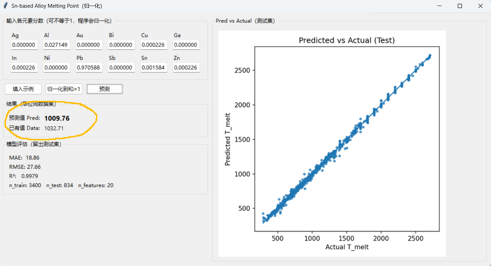

# 基于相图网格的 Sn 系多元合金熔点机器学习预测  
**Machine Learning Prediction of Melting Point for Sn-Based Multicomponent Alloys from Phase-Map Grids**

**作者 / Author:** _Your Name_  
**日期 / Date:** 2025-MM-DD  
**代码仓库 / Repo:** `sn-melting-point-ml`

---

## 目录 / Table of Contents
- [摘要 / Abstract](#摘要--abstract)
- [数据与标签构造 / Data & Target Construction](#数据与标签构造--data--target-construction)
- [图形界面 / GUI](#图形界面--gui)
- [方法 / Methods](#方法--methods)
  - [特征工程 / Feature Engineering](#特征工程--feature-engineering)
  - [数据划分 / Split Strategy](#数据划分--split-strategy)
  - [模型 / Models](#模型--models)
- [工具与使用 / Tools & Usage](#工具与使用--tools--usage)
  - [训练与评估 / Train & Evaluate](#训练与评估--train--evaluate)
- [结果 / Results](#结果--results)

---

## 摘要 / Abstract

**中文**  
本项目基于单一数据源 `SnMeltingPoint.xlsx` 的相图网格数据，为每一组唯一成分（12 个元素分数，和为 1）自动抽取其**首次出现液相（LIQUID）**的**最低温度**作为熔点标签 `T_melt`，并在此基础上构建**特征工程 + 分组验证**的回归模型。主模型为 HistGradientBoosting，并与 RandomForest、ElasticNet(+二次多项式) 对比。在严格留出测试集上获得 **MAE ≈ 18.86、RMSE ≈ 27.66、R² ≈ 0.9979**（单位随数据集）。项目提供**零参数命令行预测**与**GUI**，可对给定成分输出预测值并**回查已有数据**（如存在）。

**English**  
From a single phase-map dataset, each unique composition’s melting point is defined as the **minimum temperature where any LIQUID phase appears**. With physics-inspired features and group-aware splitting, HistGradientBoosting achieves **MAE ≈ 18.86, RMSE ≈ 27.66, R² ≈ 0.9979** on a held-out test set. A zero-arg CLI and a GUI provide predictions and robust look-ups of existing data points.

---

## 数据与标签构造 / Data & Target Construction

- **原始文件 / Source**：`SnMeltingPoint.xlsx`（**27910 × 14**）  
  - **成分分数 / Fractions (12)**：`Ag, Al, Au, Bi, Cu, Ga, In, Ni, Pb, Sb, Sn, Zn`（每行和为 1）  
  - **温度 / Temperature**：`T`  
  - **相名 / Phase**：包含如 `FCC_A1#1`, `LIQUID#2` 等
- **熔点标签 / T_melt**：对每个**唯一成分向量**，在其所有记录中筛选 `Phase` 含 “LIQUID” 的行，取 **最小 `T`** 作为 `T_melt`。  
- **监督样本量 / Labeled samples**：约 **4234** 组唯一成分（其余成分在所给温度范围内无液相或缺记录）。  

> *We map each unique composition to the minimal temperature with any LIQUID phase and use it as the regression label.*

---

## 图形界面 / GUI

  


本项目提供了一个简洁的图形界面（GUI），用于熔点预测与已有数据查找：

- **输入区**：12 个输入框，对应元素分数（Ag, Al, Au, Bi, Cu, Ga, In, Ni, Pb, Sb, Sn, Zn）。输入数值将按原样使用，不做归一化。  
- **操作按钮**：  
  - “填入示例”：自动填充一个 Sn 主体示例。  
  - “预测”：调用模型输出预测值。  
- **结果区**：显示 **预测值 Pred** 和 **已有值 Data**（若原始数据中能匹配到则显示数值，否则显示“没有数据”）。  
- **评估信息**：展示模型在测试集上的性能指标（MAE、RMSE、R² 等）。  
- **右侧图表**：显示 Pred vs Actual 散点图，用于直观查看预测效果。

---

## 方法 / Methods

### 特征工程 / Feature Engineering

- **基础特征 / Base (12)**：原始元素分数 \(\sum_i x_i = 1\)。  
- **物理/统计启发特征 / Physics- & statistics-inspired (8)**（不依赖外部性质表）：  
  1. `mixing_entropy = -Σ x_i ln x_i`（无量纲近似）  
  2. `num_components = Σ 1[x_i > 0]`  
  3. `max_frac, min_frac`  
  4. `var_frac`（分数方差）  
  5. `gini_diversity = 1 - Σ x_i^2`  
  6. `sn_frac = x_Sn`, `sn_major = 1[x_Sn ≥ 0.5]`
- **线性基线交互（用于 ElasticNet）/ Quadratic interactions for ElasticNet**：  
  对 12 分数做二次多项式扩展（一次项、平方项、两两乘积），配合标准化与 ElasticNet 正则以刻画非线性与抑制共线性。  
- **树模型无需缩放 / Trees don’t require scaling**：HGBR/RF 直接使用“12 分数 + 8 组合特征”。

### 数据划分 / Split Strategy

- **动机**：相图是成分网格；相近成分跨集合会导致信息泄漏。  
- **方案**：将成分四舍五入到 **0.01** 形成**组 ID**；按组随机划分**测试集 20%**；训练集内用 **GroupKFold(3)** 验证。  
- **规模**：`n_train = 3400`，`n_test = 834`，`n_features = 20`。

### 模型 / Models

- **主模型 / Primary**：`HistGradientBoostingRegressor`（learning_rate=0.1, max_iter=600, max_depth=None）。  
- **对比 / Baselines**：`RandomForestRegressor`，`ElasticNet` (+ PolynomialFeatures + StandardScaler)。  
- **指标 / Metrics**：MAE、RMSE、R²（全部在严格留出测试集上报告）。

---

## 工具与使用 / Tools & Usage

### 训练与评估 / Train & Evaluate
```bash
pip install -r requirements.txt
```
# 训练并生成评估与图像
python src/train_and_evaluate_sn_melting_point.py --data data/SnMeltingPoint.xlsx --outdir outputs
# 产物：
#   outputs/best_model.joblib
#   outputs/metrics.json
#   outputs/figures/pred_vs_actual.png
#   outputs/permutation_importance_top20.csv

---

## 结果 / Results

**留出测试集表现 / Held-out Test Performance**  
（单位与原始数据一致 / Units follow the dataset）

- **MAE**: **18.8648**  
- **RMSE**: **27.6568**  
- **R²**: **0.997906**  
- **n_train**: **3400** **n_test**: **834** **n_features**: **20**

**预测 vs 真实 / Predicted vs Actual (Test)**  


> 置换重要性前 20 已输出至 `outputs/permutation_importance_top20.csv` 以供报告与讨论。  
> *Top-20 permutation importances are in `outputs/permutation_importance_top20.csv`.*

